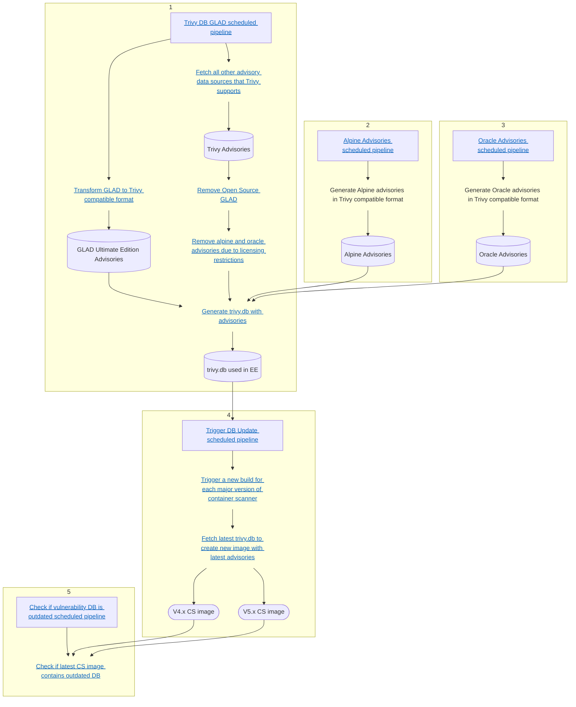

# Gitlab EE Trivy database build flow
This diagram describes how the EE database is built and includes links to the source code and scheduled pipelines.
<div class="center">


</div>

# How to run Trivy locally with the EE database

The Trivy databse is a [bbolt](https://github.com/etcd-io/bbolt) database file
which is stored on the file system inside `$CACHE_DIR/trivy/db/`. `$CACHE_DIR`
is the output of [`os.UserCacheDir`](https://pkg.go.dev/os#UserCacheDir),
which varies depending on your operating system. We host the EE database
as a blob inside the GitLab container registry. To use it, you will need to download it,
place it inside the cache directory, then run Trivy with the `--skip-db-update` flag.
Continue reading for more details on how to do this.

## Prerequisites

1. [Install Trivy](https://aquasecurity.github.io/trivy/latest/getting-started/installation/)
1. [Install ORAS](https://oras.land/cli/)

## Installing the EE Database

1. Determine your cache directory by referencing [`os.UserCacheDir`](https://pkg.go.dev/os#UserCacheDir).
   On MacOS it is `~/Library/Caches/`. On Linux it is `~/.cache` (most of the time).

   ```shell
   export CACHE_DIR=~/Library/Caches
   ```

1. Run `trivy i --reset` to remove any existing databases. This will ensure you are using the correct one.
1. Use ORAS to download the EE database and place it inside your cache.

   ```shell
   mkdir -p "${CACHE_DIR}/trivy/db"
   oras pull registry.gitlab.com/gitlab-org/security-products/dependencies/trivy-db-glad:2 -a && \
     tar -zxvf db.tar.gz -C "${CACHE_DIR}/trivy/db" && \
     rm db.tar.gz
   ```

1. Run trivy with `--skip-db-update` to avoid replacing the EE database with the default Trivy DB:

    ```shell
    $ trivy i --skip-db-update amazoncorretto:8
    2022-05-19T06:38:56.609-0500	INFO	Detected OS: amazon
    2022-05-19T06:38:56.609-0500	INFO	Detecting Amazon Linux vulnerabilities...
    2022-05-19T06:38:56.612-0500	INFO	Number of language-specific files: 0

    amazoncorretto:8 (amazon 2 (Karoo))
    ===================================
    Total: 8 (UNKNOWN: 0, LOW: 0, MEDIUM: 8, HIGH: 0, CRITICAL: 0)

    +---------+------------------+----------+--------------------+--------------------+---------------------------------------+
    | LIBRARY | VULNERABILITY ID | SEVERITY | INSTALLED VERSION  |   FIXED VERSION    |                 TITLE                 |
    +---------+------------------+----------+--------------------+--------------------+---------------------------------------+
    | curl    | CVE-2022-22576   | MEDIUM   | 7.79.1-1.amzn2.0.1 | 7.79.1-2.amzn2.0.1 | curl: OAUTH2 bearer bypass            |
    |         |                  |          |                    |                    | in connection re-use                  |
    |         |                  |          |                    |                    | -->avd.aquasec.com/nvd/cve-2022-22576 |
    +         +------------------+          +                    +                    +---------------------------------------+
    |         | CVE-2022-27774   |          |                    |                    | curl: credential leak on redirect     |
    |         |                  |          |                    |                    | -->avd.aquasec.com/nvd/cve-2022-27774 |
    +         +------------------+          +                    +                    +---------------------------------------+
    |         | CVE-2022-27775   |          |                    |                    | curl: bad local IPv6 connection reuse |
    |         |                  |          |                    |                    | -->avd.aquasec.com/nvd/cve-2022-27775 |
    +         +------------------+          +                    +                    +---------------------------------------+
    |         | CVE-2022-27776   |          |                    |                    | curl: auth/cookie leak on redirect    |
    |         |                  |          |                    |                    | -->avd.aquasec.com/nvd/cve-2022-27776 |
    +---------+------------------+          +                    +                    +---------------------------------------+
    | libcurl | CVE-2022-22576   |          |                    |                    | curl: OAUTH2 bearer bypass            |
    |         |                  |          |                    |                    | in connection re-use                  |
    |         |                  |          |                    |                    | -->avd.aquasec.com/nvd/cve-2022-22576 |
    +         +------------------+          +                    +                    +---------------------------------------+
    |         | CVE-2022-27774   |          |                    |                    | curl: credential leak on redirect     |
    |         |                  |          |                    |                    | -->avd.aquasec.com/nvd/cve-2022-27774 |
    +         +------------------+          +                    +                    +---------------------------------------+
    |         | CVE-2022-27775   |          |                    |                    | curl: bad local IPv6 connection reuse |
    |         |                  |          |                    |                    | -->avd.aquasec.com/nvd/cve-2022-27775 |
    +         +------------------+          +                    +                    +---------------------------------------+
    |         | CVE-2022-27776   |          |                    |                    | curl: auth/cookie leak on redirect    |
    |         |                  |          |                    |                    | -->avd.aquasec.com/nvd/cve-2022-27776 |
    +---------+------------------+----------+--------------------+--------------------+---------------------------------------+
    ```
